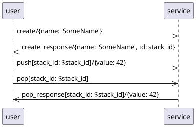

# Asyncapi

Receive and send valid asyncapi messages over MQTT.


## about

wie swagger/openapi aber async.

1. The service-user publishes a message to MQTT
    ```
    %{
        payload: %{"value" => 42},
        topic: "stack/push/4711"
    }
    ```
2. the service has subscribed to the topic, thus Asyncapi receives the mqtt message
3. maps it to the operation push operation (linked push-channel has a matching address)
4. parameter and payload are validated against the payload schema
    ```
    %Asyncapi.Message{
        op_id: "push",
        params: %{stack_id: 4711},
        payload: %Payload.Push{value: 42},
    }}
    ```

### Sequence diagram testing DSL

```
A->>B: <op-id>[<params>]/<payload>
```

test (`user`) publishes a msg with op-id: `create`, no params, payload: `{name: 'SomeName'}`
```
user->>service: create/{name: 'SomeName'}
```

test (`user`) expects to receive a msg, binds `id` from received payload to `stack_id`
```
service->>user: create_response/{name: 'SomeName', id: stack_id}
```

dereferencing bound `stack_id`
```
user->>service: push[stack_id: $stack_id]/{value: 42}
```




- `mix test` automatically converts this into tests
- change tests in schema/bundled/user.json


When using MQTT (not Dummy) you can run this before tests:

```
docker run -d -p 1883:1883 --name nanomq emqx/nanomq:latest
docker start nanomq
...
docker stop nanomq
```

## TODO

### Prio 1

- nano-mq per system-call weg (brauchts nicht mehr mit dummy-broker)
- struct generator
    - [ ] muss recompilen wenn neue APIs in config gibt oder wenn sich diese geaendert haben
    - [ ] muss automatisch bundlen
    - [ ] SchemaModule.MessagePayload.<message-name>
- [ ] handling of invalid messages from outside, cant just raise ->TO-DO-1
- [ ] when an internal message is the last in a sequence, it may not be received before test ends!
- [ ] `quote` option `location` (um bessere fehlermeldungen in test zu haben)
- [ ] nested maps
    - [ ] damit: offset: {type, num} state random_offset, random_type

### Prio 2

- [ ] retained messages
- [ ] Logging -> TO-DO-2
- [ ] bessere trennung MqttAsyncAPI, broker impl ->TO-DO-3
- [ ] @BM - run tests in all examples also
- [ ] check if a sequence step is even possible first (`from` has operation)
- [ ] test coverage in examples
- [ ] custom types in schema (eg channel-id?)

### backlog

- [ ] render api like "asyncapi studio" but with seq diag
- [ ] sequence regions that can be reused (eg dp-write, add-scene, ...)
- [ ] jsv lib evaluieren (@BM)
- [ ] https://hexdocs.pm/ex_json_schema/readme.html#validation-error-formats
- [ ] echte DSL (geht --> ?)

- [x] make mqtt-client robust
- [x] create a more involved sample service with state, implementing a stack
- [x] bundle files, so that we can use tools that can not use multiple files, sth like this should do it 
- [x] understand traits
- [x] TestAsyncapi via Registry statt broker (Registry.select)
- [x] Payloads -> Structs 
- [x] Structs benutzen in Asyncapi und examples
- [x] examples in eigene projects
- [x] @BM kann man auf UserDummy module verzichten -> ja
- [x] erste ID `0` (implementation detail) muss in schema auftauchen? 
- [x] handle nil in sequence parser (needed in "pop from empty")
- [x] generate_tests nicht mit hardcoded pfad aufrufen
- [x] internal messages
- [x] jump to asyncapi code from example project-IDE code and terminal - geht nicht
- [x] dopplung runtime/config
- [x] structs diskutieren.
    - generell gut
    - schlecht direkt struct fuer payload zu machen, da die keinen namen haben
    - jetzt von message namen, aber nur payload. gibt dann viele gleiche mit unterschiedl namen. auch nicht gut
    - ganze message? (incl param)
    - ganze operation? (incl param und opid)
    - doch irgendwie nur payload?
    - root namen von title abgeleitet nicht gut

## Module Generator / Structs


```
  SchemaModule                           SchemaModule                                          
  operation-perspective-user──►channel◄──operation-perspective-service  
                            1 1   │1                                    
                                  │                                     
                                  ▼n                                    
                               message                                  
                                  │1                                    
                                  │                                     
                                  ▼1                                    
                               payload                                  
                                                                        
```

op, ch und msg haben ID:

operationId: {operation-object}
channelId: {channel-object}
messageId: {message-object}

payload hat keine ID, da: 
message-object:.payload -> schema-object
das schema-object hat keine ID und weiss auch nicht, dass es ein payload ist!

parameter haben auch keine ID, sondern ein "field pattern" ist aber bei MQTT quasi eine ID (relativ zu channel)
??? auch parameter-struct ??? --> spaeter evtl wenn Anwendugsfall dafuer da

- op-ids die auf gleichen channel gehen koennen unterschiedlich sein, es kann evtl auch unterschiedliche (rueckwaertskompatible) versionen gebene. daher sinnvoll, dass es aus jeder perspektive eine eigene struct gibt


## Notes

### JSONSchema


- `required` und `default` zusammen auf einer prop sinnlos, da mit struct `@enforce_keys` default in struct egal, muss immer gegeben werden
- `"additionalProperties": true` sinnlos mit struct
- es wird nicht gechecked, ob die parameter die in channel/address genutzt werden auch definiert sind!
- message name muss gesetzt und uniq sein in schema (module)
- asyncapi validator sieht nicht wenn required und properties nicht zusammen passen

## References

- https://www.asyncapi.com 
  - asyncpi CLI for bundling, conversion and validation
  - https://studio.asyncapi.com/
- https://json-schema.org/
- https://github.com/jonasschmidt/ex_json_schema