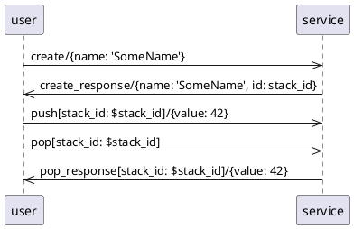

# Asyncapi

Receive and send valid asyncapi messages over MQTT.


## about asyncapi.com

like swagger/openapi but async.

1. The service-user publishes a message to MQTT
    ```
    %{
        payload: %{"value" => 42},
        topic: "stack/push/4711"
    }
    ```
2. the service has subscribed to the topic, thus Asyncapi receives the mqtt message
3. maps it to the operation push operation (linked push-channel has a matching address)
4. parameter and payload are validated against the payload schema
    ```
    %Asyncapi.Message{
        op_id: "push",
        params: %{stack_id: 4711},
        payload: %Payload.Push{value: 42},
    }}
    ```

### Sequence diagram testing DSL

TODO: document how to take full controll of an internal service like the time server (like in timer-service)
TODO: document that one has to use capture-log to see sequence on failure
TODO: document the convention that internal-server-pids are given in service_opts and names have to match in service-code and the test-sequence
TODO: document:  assert is_atom(internal_message_tag),
    so we have to do GenServer.cast(server, {:schedule_timeout, {pid, timeout, tag}})
    instead of GenServer.cast(server, {:schedule_timeout, pid, timeout, tag})
TODO: document: seq must start after init, use handle_continue. send_after(..., >0) does not work also

```
A->>B: <op-id>[<params>]/<payload>
```

test (`user`) publishes a msg with op-id: `create`, no params, payload: `{name: 'SomeName'}`
```
user->>service: create/{name: 'SomeName'}
```

test (`user`) expects to receive a msg, binds `id` from received payload to `stack_id`
```
service->>user: create_response/{name: 'SomeName', id: stack_id}
```

dereferencing bound `stack_id`
```
user->>service: push[stack_id: $stack_id]/{value: 42}
```




- `mix test` automatically converts this into tests
- change tests in schema/bundled/user.json


When using MQTT (not Dummy) you can run this before tests:

```
docker run -d -p 1883:1883 --name nanomq emqx/nanomq:latest
docker start nanomq
...
docker stop nanomq
```


## Module Generator / Structs


```
  SchemaModule                           SchemaModule                                          
  operation-perspective-user──►channel◄──operation-perspective-service  
                            1 1   │1                                    
                                  │                                     
                                  ▼n                                    
                               message                                  
                                  │1                                    
                                  │                                     
                                  ▼1                                    
                               payload                                  
                                                                        
```

op, ch und msg haben ID:

operationId: {operation-object}
channelId: {channel-object}
messageId: {message-object}

payload hat keine ID, da: 
message-object:.payload -> schema-object
das schema-object hat keine ID und weiss auch nicht, dass es ein payload ist!

parameter haben auch keine ID, sondern ein "field pattern" ist aber bei MQTT quasi eine ID (relativ zu channel)
??? auch parameter-struct ??? --> spaeter evtl wenn Anwendugsfall dafuer da

- op-ids die auf gleichen channel gehen koennen unterschiedlich sein, es kann evtl auch unterschiedliche (rueckwaertskompatible) versionen gebene. daher sinnvoll, dass es aus jeder perspektive eine eigene struct gibt


## Notes

### JSONSchema


- `required` und `default` zusammen auf einer prop sinnlos, da mit struct `@enforce_keys` default in struct egal, muss immer gegeben werden
- `"additionalProperties": true` sinnlos mit struct
- es wird nicht gechecked, ob die parameter die in channel/address genutzt werden auch definiert sind!
- message name muss gesetzt und uniq sein in schema (module)
- asyncapi validator sieht nicht wenn required und properties nicht zusammen passen

## References

- https://www.asyncapi.com 
  - asyncpi CLI for bundling, conversion and validation
  - https://studio.asyncapi.com/
- https://json-schema.org/
- https://github.com/jonasschmidt/ex_json_schema
- https://www.learnjsonschema.com/2020-12/ - best resource for jsonschema


       