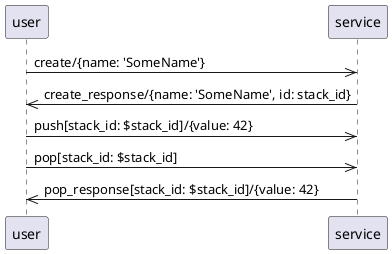

# MultiStack

## Asyncapi

wie swagger/openapi aber async.

1. The service-user publishes a message to MQTT
    ```
    %{
        payload: %{"value" => 42},
        topic: "stack/push/4711"
    }
    ```
2. the service has subscribed to the topic, thus Asyncapi receives the mqtt message
3. maps it to the operation push operation (linked push-channel has a matching address)
4. parameter and payload are validated against the payload schema
    ```
    %Asyncapi.Message{
        op_id: "push",
        params: %{stack_id: 4711},
        payload: %Payload.Push{value: 42},
    }}
    ```

## Sequence diagram testing DSL

```
A->>B: <op-id>[<params>]/<payload>
```

test (`user`) publishes a msg with op-id: `create`, no params, payload: `{name: 'SomeName'}`
```
user->>service: create/{name: 'SomeName'}
```

test (`user`) expects to receive a msg, binds `id` from received payload to `stack_id`
```
service->>user: create_response/{name: 'SomeName', id: stack_id}
```

dereferencing bound `stack_id`
```
user->>service: push[stack_id: $stack_id]/{value: 42}
```




- `mix test` automatically converts this into tests
- change tests in schema/bundled/user.json